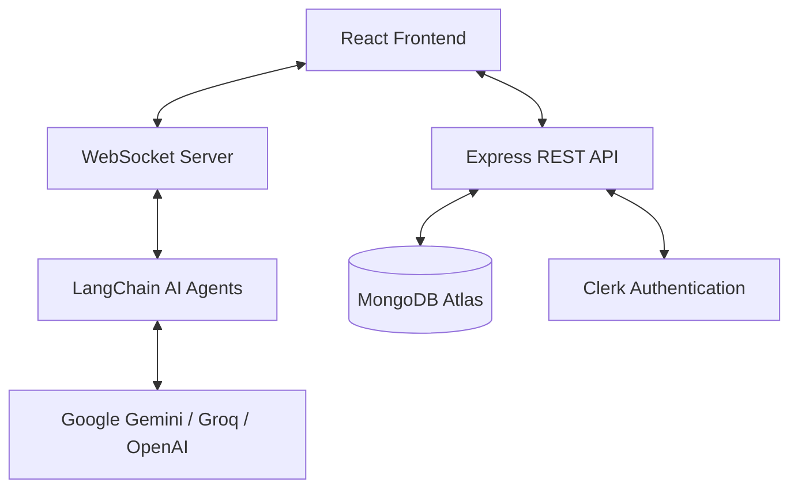

# CrackIt: AI-Powered Interview Preparation Platform

Welcome to the technical documentation for **CrackIt**, a state-of-the-art platform designed to help developers ace their technical, DSA, System Design, and HR interviews through realistic, AI-driven simulations.

## 🚀 Overview

CrackIt leverages modern Large Language Models (LLMs) and real-time communication technologies to provide a high-fidelity interview experience. Unlike static question banks, CrackIt adapts to the user's resume, specific job targets, and real-time performance, offering personalized feedback and follow-up questions just like a human interviewer.

---

## 🏗️ Architecture

CrackIt follows a classic **Full-Stack MERN** architecture, enhanced with **LangChain/LangGraph** for AI orchestration and **WebSockets** for low-latency interactions.



### 🔐 Security & "API Key Wallet"
One of CrackIt's core security features is the **API Key Wallet**. 
- Users can provide their own LLM API keys (Gemini, Groq, etc.).
- These keys are **AES-256 encrypted** before being stored in MongoDB.
- Keys are only decrypted in-memory during an active interview session using a secure `requestContext` pattern, ensuring that the user's credentials remain private and protected.

---

## 💻 Tech Stack

### Frontend
- **Framework**: [React](https://react.dev/) + [Vite](https://vitejs.dev/)
- **Styling**: [Tailwind CSS](https://tailwindcss.com/) + [Framer Motion](https://www.framer.com/motion/) (for smooth animations)
- **Editor**: [@monaco-editor/react](https://www.npmjs.com/package/@monaco-editor/react) (VS Code experience for coding rounds)
- **Auth**: [Clerk](https://clerk.com/) for secure user management and social login.
- **Visuals**: [Recharts](https://recharts.org/) for performance analytics; [Lucide React](https://lucide.dev/) for iconography.
- **Audio/Video**: [React Webcam](https://www.npmjs.com/package/react-webcam) for simulating the interview environment.

### Backend
- **Server**: [Node.js](https://nodejs.org/) with [Express](https://expressjs.com/)
- **Real-time**: [ws (WebSockets)](https://www.npmjs.com/package/ws) for seamless chat/code/voice interactions.
- **Database**: [MongoDB](https://www.mongodb.com/) with [Mongoose](https://mongoosejs.com/)
- **AI Orchestration**: [LangChain](https://www.langchain.com/) & [LangGraph](https://www.langchain.com/langgraph)
- **File Parsing**: [pdf-parse](https://www.npmjs.com/package/pdf-parse) for extracting data from resumes.

---

## 🤖 AI Agents & Workflows

CrackIt uses a multi-agent system to handle different aspects of the interview. Each agent is a specialized expert:

| Agent | Purpose |
| :--- | :--- |
| **Interview Plan Agent** | Analyzes resumes to generate custom questions tailored to your experience. |
| **DSA Agent** | Generates Data Structure & Algorithm problems (Easy, Medium, Hard). |
| **DSA Interview Agent** | Evaluates coding logic, space/time complexity, and code quality in real-time. |
| **System Design Agent** | Focuses on scalability, reliability, and high-level architecture. |
| **HR/Behavioral Agent** | Evaluates soft skills, culture fit, and STAR-method responses. |
| **STT Correction Agent** | Uses AI to fix transcription errors from Speech-to-Text for better evaluation. |
| **Report Agent** | Compiles all feedback into a comprehensive performance dashboard. |

---

## 🎯 Key Features & Interview Rounds

### 1. Resume-Based Rounds
The system parses your PDF resume and generates questions that drill into your specific projects, technologies, and achievements mentioned in your profile.

### 2. DSA Specialist Round
A structured approach to coding interviews:
- **Intuition Phase**: Discuss your approach and time complexity before writing any code.
- **Coding Phase**: Write code in a Monaco-based editor with real-time feedback.
- **Evaluation Phase**: The AI analyzes your solution for edge cases and optimizations.

### 3. HR & Behavioral Rounds
Simulates standard HR screenings, focusing on behavioral questions, past experiences, and future goals.

### 4. Interactive Feedback
Unlike standard testers, the AI can ask follow-up questions if your answer is vague, mimicking a real conversational flow.

---

## 📁 Directory Structure

```text
crackit/
├── client/              # React Frontend (Vite)
│   ├── src/
│   │   ├── pages/       # Dashboards, Interview Room, Reports
│   │   ├── components/  # AI Chat, Code Editor, Webcam Feed
│   │   └── hooks/       # Custom WebSocket and Auth hooks
├── server/              # Node.js Backend (Express)
│   ├── agents/          # AI logic and Prompt Templates
│   ├── routes/          # RESTful endpoints (Auth, Sessions, Settings)
│   ├── services/        # WebSocket orchestrator & Code Execution
│   ├── models/          # Mongoose Schemas (User, Session, Profile)
│   └── utils/           # Encryption, Logging, and Request Context
└── extension/           # (Optional) Browser extension for live practice
```

---

## 🛠️ Getting Started

### Prerequisites
- Node.js (v18+)
- MongoDB Atlas account
- Clerk account (for Auth)
- LLM API Keys (Gemini, Groq, or OpenAI)

### Installation

1. **Clone the repo**
2. **Setup Server**:
   ```bash
   cd server
   npm install
   # Create .env file with MONGODB_URI, CLERK_SECRET_KEY, etc.
   npm run dev
   ```
3. **Setup Client**:
   ```bash
   cd client
   npm install
   # Create .env file with VITE_CLERK_PUBLISHABLE_KEY, etc.
   npm run dev
   ```

---

## 📈 Future Roadmap
- [ ] Support for multiple coding languages beyond Python/JS/Java.
- [ ] Integration with Judge0 for sandboxed code execution tests.
- [ ] Detailed heatmap of "blind spots" in DSA categories.
- [ ] Collaborative interview modes for peer-to-peer prep.

---
*Documentation generated by Antigravity AI.*
